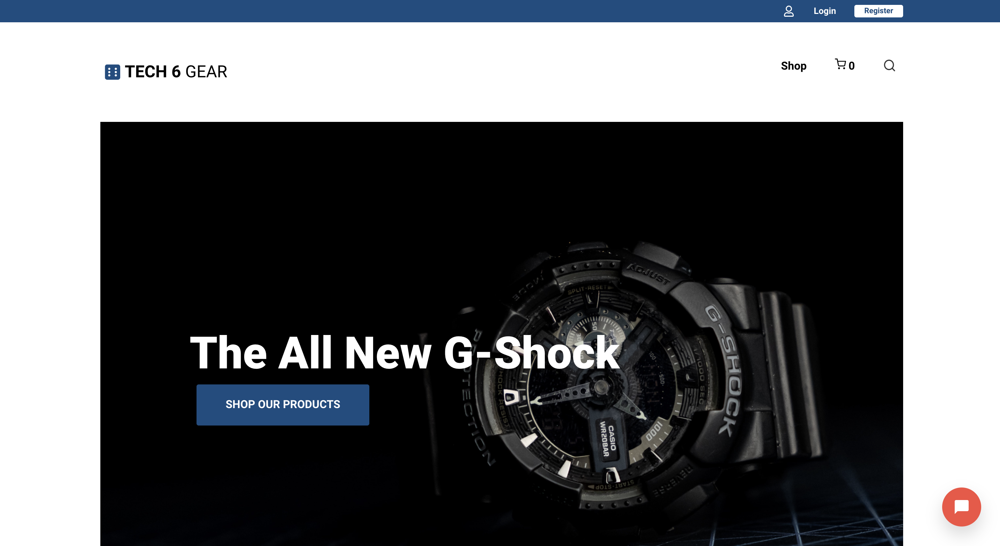
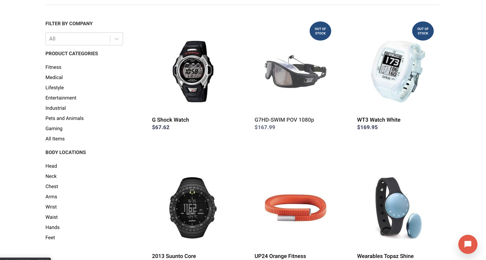
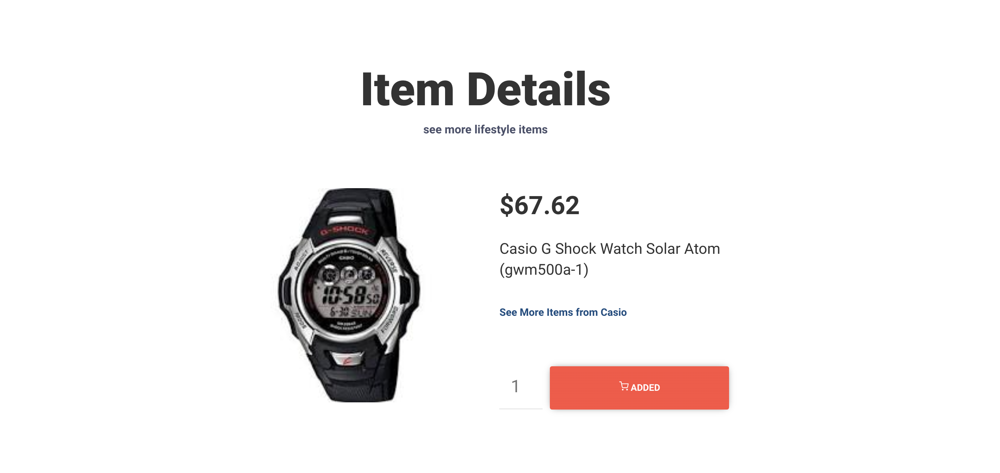
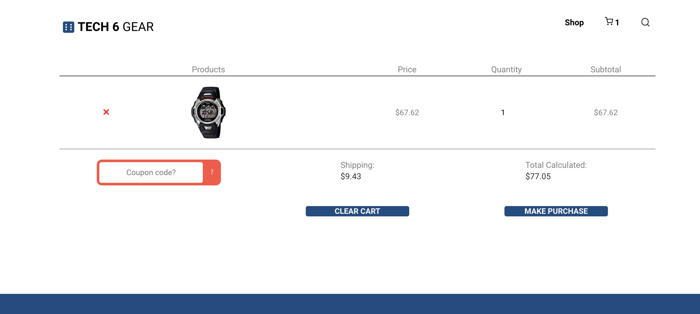

### E-Commerce Team Project - Full Stack

Users can browse different items, add items to the cart and much more!
Technologies: React, Node.js, Express, MongoDb - (MERN)

### Getting Started
These instructions will get you a copy of the project up and running on your local machine for development and testing purposes.

Go to the server directory. Run npm install/yarn install followed by npm start/yarn start. The server will be running on port 4000

Go to the client directory. Run npm install/yarn install followed by npm start/yarn start. Accept to listen to FE on port 3000

### Flow for user.

## Home
### Home Page.

## Shop
### Shop for different items - also options to filter by company, price, category, body-part.

### Item Details.

### Cart Details.

## Responsive Design

### Prerequisites
-node.js, npm/yarn

### Built With
Node.js, MongoDb- Backend
React - FrontEnd

### Authors
Manider Dheer.
Matteo, Myra, Harrison. (Team members.)

### License
This project is licensed under the MIT License - see the LICENSE.md file for details

### Acknowledgments
Thank you to everyone in the team!
